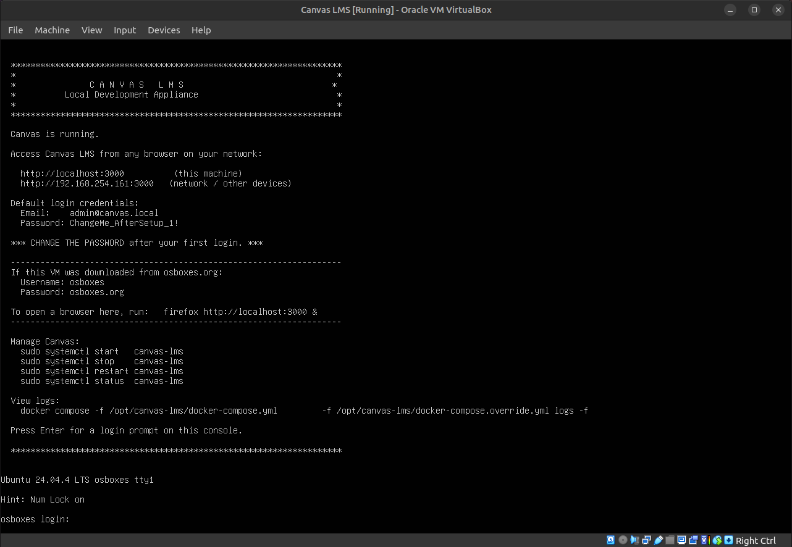

<p align="center">
  
</p>

# Canvas LMS Setup Toolkit

> Fully automated Canvas LMS local development setup for Ubuntu GNU/Linux, macOS, and Windows

A self-contained setup toolkit by [PrivacySafe Foundation, Inc.](https://privacysafe.foundation)

## Quick Start

### Ubuntu GNU/Linux 24.04

```bash
chmod +x canvas-setup.sh
./canvas-setup.sh --install-path ~/canvas-lms

# Or to a system path (requires sudo):
sudo ./canvas-setup.sh --install-path /opt/canvas-lms --port 9000
```

### macOS (Monterey 12+)

```bash
chmod +x canvas-setup-macos.sh
./canvas-setup-macos.sh --install-path ~/canvas-lms
```

### Windows (PowerShell)

```powershell
# If you see "running scripts is disabled":
Set-ExecutionPolicy -Scope CurrentUser -ExecutionPolicy RemoteSigned

.\canvas-setup-windows.ps1 -InstallPath C:\canvas-lms
```

After the script completes, open `http://localhost:3000` (or your chosen port) and log in with the credentials printed at the end.

> **Change the admin password after your first login.**

## Options

| Flag | GNU/Linux / macOS | Windows | Default |
|------|---------------|---------|---------|
| Install path | `--install-path PATH` | `-InstallPath PATH` | *(required)* |
| Port | `--port PORT` | `-Port PORT` | `3000` |
| Mirror (China) | `--mirror` | `-UseMirror` | off |

The `--mirror` / `-UseMirror` flag routes the git clone through Gitee and Docker image pulls through `docker.1ms.run`, for users on networks where GitHub or Docker Hub is slow or blocked.

## What Each Script Does

1. **Checks and installs prerequisites** — Docker, Git, Python 3 (Ubuntu GNU/Linux installs Docker CE from Docker's official APT repo; macOS uses Homebrew + Docker Desktop; Windows checks for Docker Desktop and offers to install Git via winget)
2. **Clones Canvas LMS** from GitHub (or Gitee mirror)
3. **Detects the correct postgres image** from Canvas's own Dockerfile — no hardcoded version
4. **Patches Dockerfiles** for compatibility — adds `[trusted=yes]` to apt repo lines, redirects EOL Debian sources to `archive.debian.org`
5. **Writes all required config files** — `database.yml`, `security.yml`, `redis.yml`, `cache_store.yml`, `domain.yml`, `outgoing_mail.yml`, `docker-compose.override.yml`
6. **Builds Docker images** (10–30 min on first run)
7. **Starts services in the correct order** — postgres and redis first, waits for the canvas database role to be ready, then starts web and jobs
8. **Installs Ruby gems and frontend assets** inside the container
9. **Creates and seeds the database** with an initial admin account
10. **Restarts web services** and waits for Passenger to signal ready before declaring success

## Prerequisites

| Requirement | Ubuntu GNU/Linux | macOS | Windows |
|-------------|--------|-------|---------|
| OS version | 24.04 | Monterey 12+ | 10 build 19041+ / 11 |
| Docker | CE (auto-installed) | Docker Desktop | Docker Desktop + WSL2 |
| Git | Auto-installed | Auto-installed via Homebrew | Auto-installed via winget |
| Python 3 | Auto-installed | Auto-installed via Homebrew | Not required |
| RAM | 8 GB+ | 8 GB+ (4 GB+ allocated to Docker Desktop) | 8 GB+ |
| Disk | 20 GB+ free | 25 GB+ free | 25 GB+ free |

### Apple Silicon (M1 / M2 / M3)

Canvas's `ruby-passenger` image is amd64-only. The macOS script automatically detects Apple Silicon, adds `platform: linux/amd64` to the compose override, and builds with Rosetta 2 emulation. Builds will take longer than on Intel — this is expected.

## Persistence

All four services (`web`, `jobs`, `postgres`, `redis`) are configured with `restart: unless-stopped` in the generated `docker-compose.override.yml`. This means Canvas starts automatically on system boot, and after Docker Desktop restarts. To stop Canvas without it restarting on next boot, use `docker compose down`.

## Managing Canvas After Setup

All commands run from your install directory:

```bash
cd ~/canvas-lms   # or wherever you installed it

# View logs
docker compose -f docker-compose.yml -f docker-compose.override.yml logs -f

# Stop
docker compose -f docker-compose.yml -f docker-compose.override.yml down

# Start
docker compose -f docker-compose.yml -f docker-compose.override.yml up -d

# Rails console
docker compose -f docker-compose.yml -f docker-compose.override.yml exec web bundle exec rails console
```

## Security Notes

All passwords and keys written by these scripts are **placeholders for local development only**. Do not expose a setup created by these scripts to the internet without:

- Changing the admin password after first login
- Replacing `sekret` (the postgres canvas user password) with a strong password in `config/database.yml` and rebuilding
- Setting a real SMTP server in `config/outgoing_mail.yml`
- Never committing `config/security.yml` — the generated encryption key is unique to your installation

## License

Canvas LMS Setup Toolkit is copyright 2026 PrivacySafe Foundation, Inc. and licensed under the **MIT License**. See [`LICENSE`](LICENSE) for the full text.

Canvas LMS is open-source software developed by Instructure, Inc. and licensed under the **GNU Affero General Public License v3.0** (AGPL-3.0). Source: https://github.com/instructure/canvas-lms

This toolkit was inspired by original work by swzhang: https://github.com/swzhangf/Canvas-LMS-Setup

See [`NOTICE`](NOTICE) for full third-party attribution.
